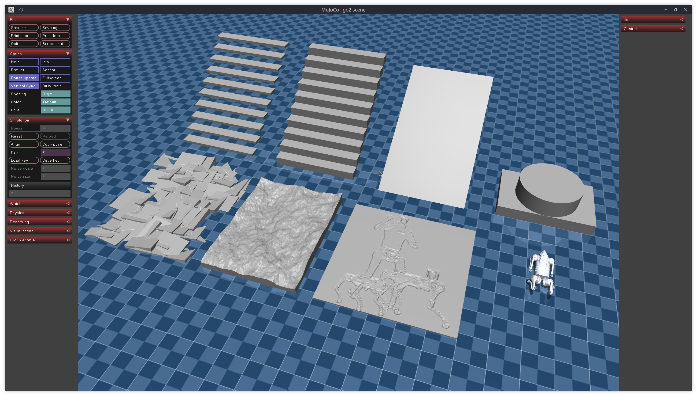

# Introduction
## Unitree mujoco
`unitree_mujoco` is a simulator developed based on `Unitree sdk2` and `mujoco`. Users can easily integrate the control programs developed with `Unitree_sdk2`, `unitree_ros2`, and `unitree_sdk2_python` into this simulator, enabling a seamless transition from simulation to physical development. The repository includes two versions of the simulator implemented in C++ and Python, with a structure as follows:


# Quick Start: G1 Seiken Demo
This repository is the **MuJoCo side**, meaning it is the sender.

The G1 seiken-zuki demo detects a `CLEAN HIT` event and sends a hit event JSON payload to a Nautilus-compatible endpoint.
Starting the Nitro Enclave, handling attestation, and submitting the signed result to Sui Devnet are done from the `~/nautilus` side.

```text
MuJoCo / unitree_mujoco
  -> sends hit event JSON

Nautilus / Nitro Enclave
  -> verifies the event and returns a signed response

Sui submit script
  -> submits the signed response to Sui Devnet
```

## 1. Activate the Python Environment
If the environment already exists:
```bash
source ~/g1_venv/bin/activate
```

If you are setting up a new machine:
```bash
cd ~
python3 -m venv g1_venv
source ~/g1_venv/bin/activate
python3 -m pip install --upgrade pip

git clone https://github.com/unitreerobotics/unitree_sdk2_python.git
cd unitree_sdk2_python
pip3 install -e .
pip3 install mujoco pygame numpy
```

## 2. Test Locally with the Mock Server
Before connecting to the real Nitro Enclave, you can verify the MuJoCo-side behavior with the local mock server.

Terminal 1:
```bash
source ~/g1_venv/bin/activate
cd ~/unitree_mujoco
python3 example/python/mock_nautilus_server.py
```

Terminal 2:
```bash
source ~/g1_venv/bin/activate
cd ~/unitree_mujoco/simulate_python
python3 g1_vs_g1_seiken_visualizer.py
```

Terminal 3:
```bash
source ~/g1_venv/bin/activate
cd ~/unitree_mujoco/example/python
python3 seiken_g1.py
```

Expected behavior:
- Two G1 robots are shown facing each other.
- One G1 repeatedly performs seiken-zuki.
- When the strike hits, the opponent head marker changes from red to green.
- `CLEAN HIT` is printed in the visualizer terminal.
- If mock posting is enabled, the mock Nautilus server returns a signed response.

You can also use the helper script to start the demo at once.
Note that this script also starts the local mock server.

```bash
cd ~/unitree_mujoco
./run_g1_seiken_demo.sh
```

## 3. Send Events to the Real Nitro Enclave
On this repository side, your job is to point the destination URL at the real Enclave endpoint and generate a new `CLEAN HIT`.

If MuJoCo and the Enclave are running on the same EC2 instance:
```bash
export NAUTILUS_URL=http://127.0.0.1:3000/process_data
```

If MuJoCo is running on another machine, such as your PC or WSL, and sends to the EC2 Enclave proxy:
```bash
export NAUTILUS_URL=http://<EC2_PUBLIC_IP>:3000/process_data
```

When sending from another machine, open TCP port `3000` in the EC2 Security Group.

Connection check:
```bash
curl http://<EC2_PUBLIC_IP>:3000/
```

If it returns `Pong!`, MuJoCo can reach the endpoint.

Do not start the local mock server when sending to the production Enclave.
Because `run_g1_seiken_demo.sh` also starts the mock server, it is safer to run the visualizer and controller manually in separate terminals for production sending.

Terminal 1:
```bash
source ~/g1_venv/bin/activate
cd ~/unitree_mujoco/simulate_python
export NAUTILUS_URL=http://<EC2_PUBLIC_IP>:3000/process_data
python3 g1_vs_g1_seiken_visualizer.py
```

Terminal 2:
```bash
source ~/g1_venv/bin/activate
cd ~/unitree_mujoco/example/python
python3 seiken_g1.py
```

Important:
- Sui has replay protection, so the same payload cannot be submitted twice.
- For demos, generate a new hit event by performing a new seiken-zuki strike.
- If the timestamp or trace changes, the payload is usually different.

## 4. Submit the Signed Response to Sui
Submitting to Sui is done from the `~/nautilus` side, not from this `unitree_mujoco` repository.

If the Enclave response is saved as `/tmp/g1_seiken_response.json`, submit it from the EC2 side like this:

```bash
cd ~/nautilus
source devnet.env

SIG=$(jq -r ".signature" /tmp/g1_seiken_response.json)
TS=$(jq -r ".response.timestamp_ms" /tmp/g1_seiken_response.json)
SESSION=$(jq -r ".response.data.session_id" /tmp/g1_seiken_response.json)
MOTION=$(jq -r ".response.data.motion" /tmp/g1_seiken_response.json)
CLEAN=$(jq -r ".response.data.clean_hit" /tmp/g1_seiken_response.json)
HITS=$(jq -r ".response.data.hit_count" /tmp/g1_seiken_response.json)
HASH=$(jq -r ".response.data.payload_hash[]" /tmp/g1_seiken_response.json | xargs printf "%02x")

./submit_seiken_result.sh \
  "$APP_PACKAGE_ID" \
  "$REGISTRY_OBJECT_ID" \
  "$MODULE_NAME" \
  "$OTW_NAME" \
  "$ENCLAVE_OBJECT_ID" \
  "$SIG" \
  "$TS" \
  "$SESSION" \
  "$MOTION" \
  "$CLEAN" \
  "$HITS" \
  "$HASH"
```

On success, the Sui output should include `Status: Success`, `SeikenResult`, and `SeikenVerified`.

## 5. Posting Configuration
To set a Nautilus-compatible endpoint:

```bash
export NAUTILUS_URL=http://127.0.0.1:3000/process_data
```

To disable posting:
```bash
export NAUTILUS_DISABLE=1
```

## 6. Single-G1 Motion Demo
Terminal 1:
```bash
source ~/g1_venv/bin/activate
cd ~/unitree_mujoco/simulate_python
python3 g1_visualizer.py
```

Terminal 2:
```bash
source ~/g1_venv/bin/activate
cd ~/unitree_mujoco/example/python
python3 stand_g1.py
python3 punch_g1.py
python3 seiken_g1.py
```

## Notes
- `~/unitree_mujoco` assumes this repository was cloned under your home directory. If you cloned it elsewhere, replace the path accordingly.
- Activate the same Python environment in every terminal.
- The G1 hand mesh has no finger joints, so this demo approximates a fist using wrist orientation.
- This repository is the sender side. Check the Enclave process and Sui objects from the `~/nautilus` side.

---

# Quick Start: SO-101 Display Demo
This repository also includes a lightweight MuJoCo viewer for the LeRobot SO-101 follower arm.

```bash
source ~/g1_venv/bin/activate
cd ~/unitree_mujoco
python3 simulate_python/so101_visualizer.py
```

Useful options:
```bash
python3 simulate_python/so101_visualizer.py --static
python3 simulate_python/so101_visualizer.py --manual
python3 simulate_python/so101_visualizer.py --check
python3 simulate_python/so101_visualizer.py --speed 0.5
python3 simulate_python/so101_visualizer.py --step 0.02
```

Controls:
- `1`-`6`: select a joint
- `Q` / `E`: move the selected joint
- `Z` / `C`: fine move the selected joint
- `Space`: pause/resume the demo joint animation
- `R`: reset the arm pose
- `H`: print controls

Run SO-101 motions from `example/python`:
```bash
# Terminal 1
source ~/g1_venv/bin/activate
cd ~/unitree_mujoco
python3 simulate_python/so101_visualizer.py --manual

# Terminal 2
source ~/g1_venv/bin/activate
cd ~/unitree_mujoco/example/python
python3 wave_so101.py
python3 pick_place_so101.py
python3 draw_circle_so101.py
```

The motion scripts send 6 joint positions to the viewer over local UDP at `127.0.0.1:12001`.

The SO-101 model files are stored under `unitree_robots/so101/`.

---

## Directory Structure
- `simulate`: Simulator implemented based on unitree_sdk2 and mujoco (C++, recommended)
- `simulate_python`: Simulator implemented based on unitree_sdk2_python and mujoco (Python)
- `unitree_robots`: MJCF description files for robots supported by unitree_sdk2
- `terrain_tool`: Tool for generating terrain in simulation scenarios
- `example`: Example programs

## Supported Unitree sdk2 Messages:
**Current version only supports low-level development, mainly used for sim to real verification of controller**
- `LowCmd`: Motor control commands
- `LowState`: Motor state information
- `SportModeState`: Robot position and velocity data
- `IMUState`: Torso IMU state at `rt/secondary_imu` topic (G1 only)

Note:
1. The numbering of the motors corresponds to the actual robot hardware. Specific details can be found in the [Unitree documentation](https://support.unitree.com/home/zh/developer).
2. In the actual robot hardware, the `SportModeState` message is not readable after the built-in motion control service is turned off. However, the simulator retains this message to allow users to utilize the position and velocity information for analyzing the developed control programs.

## Related links
- [unitree_sdk2](https://github.com/unitreerobotics/unitree_sdk2)
- [unitree_sdk2_python](https://github.com/unitreerobotics/unitree_sdk2_python)
- [unitree_ros2](https://github.com/unitreerobotics/unitree_ros2)
- [Unitree Doc](https://support.unitree.com/home/zh/developer)
- [Mujoco Doc](https://mujoco.readthedocs.io/en/stable/overview.html)

## Message (DDS idl) type description
- Unitree Go2, B2, H1, B2w, Go2w robots use unitree_go idl for low-level communication.
- Unitree G1, H1-2 robot uses unitree_hg idl for low-level communication.


# Installation
## C++ Simulator (simulate)
### 1. Dependencies

```bash
sudo apt install libyaml-cpp-dev libspdlog-dev libboost-all-dev libglfw3-dev
```

#### unitree_sdk2
It is recommended to install `unitree_sdk2` in `/opt/unitree_robotics` path.
```bash
git clone https://github.com/unitreerobotics/unitree_sdk2.git
cd unitree_sdk2/
mkdir build
cd build
cmake .. -DCMAKE_INSTALL_PREFIX=/opt/unitree_robotics
sudo make install
```
For more details, see: https://github.com/unitreerobotics/unitree_sdk2
#### mujoco

Download the mujoco [release](https://github.com/google-deepmind/mujoco/releases), and extract it to the `~/.mujoco` directory;

```
cd unitree_mujoco/simulate/
ln -s ~/.mujoco/mujoco-3.3.6 mujoco
```

### 2. Compile unitree_mujoco
```bash
cd unitree_mujoco/simulate
mkdir build && cd build
cmake ..
make -j4
```
### 3. Test:
Run:
```bash
./unitree_mujoco -r go2 -s scene_terrain.xml
```
You should see the mujoco simulator with the Go2 robot loaded.
In a new terminal, run:
```bash
./test
```
The program will output the robot's pose and position information in the simulator, and each motor of the robot will continuously output 1Nm of torque.

**Note:** The testing program sends the unitree_go message. If you want to test G1 robot, you need to modify the program to use the unitree_hg message.

## Python Simulator (simulate_python)
### 1. Dependencies
#### unitree_sdk2_python
```bash
cd ~
sudo apt install python3-pip
git clone https://github.com/unitreerobotics/unitree_sdk2_python.git
cd unitree_sdk2_python
pip3 install -e .
```
If you encounter an error during installation:
```bash
Could not locate cyclonedds. Try to set CYCLONEDDS_HOME or CMAKE_PREFIX_PATH
```
Refer to: https://github.com/unitreerobotics/unitree_sdk2_python
#### mujoco-python
```bash
pip3 install mujoco
```

#### joystick
```bash
pip3 install pygame
```

### 2. Test
```bash
cd ./simulate_python
python3 ./unitree_mujoco.py
```
You should see the mujoco simulator with the Go2 robot loaded.
In a new terminal, run:
```bash
python3 ./test/test_unitree_sdk2.py
```
The program will output the robot's pose and position information in the simulator, and each motor of the robot will continuously output 1Nm of torque.

**Note:** The testing program sends the unitree_go message. If you want to test G1 robot, you need to modify the program to use the unitree_hg message.

### 3. G1 Demo Motions
The repository also includes simple G1 visualization demos built on top of `unitree_sdk2_python`.

#### Setup on a new environment
Create and activate a Python virtual environment. The environment name is arbitrary; the examples below use `g1_venv`.
```bash
cd ~
python3 -m venv g1_venv
source ~/g1_venv/bin/activate
python3 -m pip install --upgrade pip
```

Install `unitree_sdk2_python` and the Python dependencies:
```bash
cd ~
git clone https://github.com/unitreerobotics/unitree_sdk2_python.git
cd unitree_sdk2_python
pip3 install -e .
pip3 install mujoco pygame numpy
```

If the environment already exists, activate it before running the demos:
```bash
source ~/g1_venv/bin/activate
```

Open two terminals for the demos. Activate the same virtual environment in both terminals.

#### Single G1 visualization
Run the lightweight G1 visualizer:
```bash
cd ./simulate_python
python3 ./g1_visualizer.py
```
In a new terminal, run one of the example motions:
```bash
cd ./example/python
python3 ./stand_g1.py
python3 ./punch_g1.py
python3 ./seiken_g1.py
```

#### G1 vs G1 seiken-zuki demo
This demo places two G1 robots face to face. One robot performs the strike, and the opponent robot stays in a fixed pose. When the strike reaches the head target, the marker changes from red to green and `CLEAN HIT` is printed in the terminal.

Run the dual-robot visualizer:
```bash
cd ./simulate_python
python3 ./g1_vs_g1_seiken_visualizer.py
```
In a new terminal, run:
```bash
cd ./example/python
python3 ./seiken_g1.py
```


# Usage
## 1. Simulation Configuration
### C++ Simulator
The configuration file for the C++ simulator is located at `/simulate/config.yaml`:
```yaml
# Robot name loaded by the simulator
# "go2", "b2", "b2w", "h1"
robot: "go2"
# Robot simulation scene file
# For example, for go2, it refers to the scene.xml file in the /unitree_robots/go2/ folder
robot_scene: "scene.xml"
# DDS domain id, it is recommended to distinguish from the real robot (default is 0 on the real robot)
domain_id: 1

use_joystick: 1 # Simulate Unitree WirelessController using a gamepad
joystick_type: "xbox" # support "xbox" and "switch" gamepad layout
joystick_device: "/dev/input/js0" # Device path
joystick_bits: 16 # Some game controllers may only have 8-bit accuracy

# Network interface name, for simulation, it is recommended to use the local loopback "lo"
interface: "lo"
# Whether to output robot link, joint, sensor information, 1 for output
print_scene_information: 1
# Whether to use virtual tape, 1 to enable
# Mainly used to simulate the hanging process of H1 robot initialization
enable_elastic_band: 0 # For H1
```
### Python Simulator
The configuration file for the Python simulator is located at `/simulate_python/config.py`:
```python
# Robot name loaded by the simulator
# "go2", "b2", "b2w", "h1"
ROBOT = "go2"
# Robot simulation scene file
ROBOT_SCENE = "../unitree_robots/" + ROBOT + "/scene.xml"  # Robot scene
# DDS domain id, it is recommended to distinguish from the real robot (default is 0 on the real robot)
DOMAIN_ID = 1  # Domain id
# Network interface name, for simulation, it is recommended to use the local loopback "lo"
INTERFACE = "lo"  # Interface
# Whether to output robot link, joint, sensor information, True for output
PRINT_SCENE_INFORMATION = True

USE_JOYSTICK = 1 # Simulate Unitree WirelessController using a gamepad
JOYSTICK_TYPE = "xbox" # support "xbox" and "switch" gamepad layout
JOYSTICK_DEVICE = 0 # Joystick number

# Whether to use virtual tape, 1 to enable
# Mainly used to simulate the hanging process of H1 robot initialization
ENABLE_ELASTIC_BAND = False
# Simulation time step (unit: s)
# To ensure the reliability of the simulation, it needs to be greater than the time required for viewer.sync() to render once
SIMULATE_DT = 0.003  
# Visualization interface runtime step, 0.02 corresponds to 50fps/s
VIEWER_DT = 0.02
```
### Joystick
The simulator will use an Xbox or Switch gamepad  to simulate the wireless controller of the robot. The button and joystick information of the wireless controller will be published through "rt/wireless_controller" topic. `use_joystick/USE_JOYSTICK` in `config.yaml/config.py` needs to be set to 0, when there is no gamepad. If your gamepad is not in Xbox or Switch layout, you can modify it in the source code (The button and joystick IDs can be  determined  using `jstest`):

In `simulate/src/unitree_sdk2_bridge/unitree_sdk2_bridge.cc`: 
```C++
 if (js_type == "xbox")
{
    js_id_.axis["LX"] = 0; // Left stick axis x
    js_id_.axis["LY"] = 1; // Left stick axis y
    js_id_.axis["RX"] = 3; // Right stick axis x
    js_id_.axis["RY"] = 4; // Right stick axis y
    js_id_.axis["LT"] = 2; // Left trigger
    js_id_.axis["RT"] = 5; // Right trigger
    js_id_.axis["DX"] = 6; // Directional pad x
    js_id_.axis["DY"] = 7; // Directional pad y

    js_id_.button["X"] = 2;
    js_id_.button["Y"] = 3;
    js_id_.button["B"] = 1;
    js_id_.button["A"] = 0;
    js_id_.button["LB"] = 4;
    js_id_.button["RB"] = 5;
    js_id_.button["SELECT"] = 6;
    js_id_.button["START"] = 7;
}
```

In `simulate_python/unitree_sdk2_bridge.py`: 
```python
if js_type == "xbox":
    self.axis_id = {
        "LX": 0,  # Left stick axis x
        "LY": 1,  # Left stick axis y
        "RX": 3,  # Right stick axis x
        "RY": 4,  # Right stick axis y
        "LT": 2,  # Left trigger
        "RT": 5,  # Right trigger
        "DX": 6,  # Directional pad x
        "DY": 7,  # Directional pad y
    }

    self.button_id = {
        "X": 2,
        "Y": 3,
        "B": 1,
        "A": 0,
        "LB": 4,
        "RB": 5,
        "SELECT": 6,
        "START": 7,
    }
```

### Elastic band for humanoid 
Consider humanoid robots are not suitable for starting in ground, a virtual elastic band was designed to simulate the lifting and lowering of humanoid robots. Setting ` enable_elastic_mand/ENABLE_ELSTIC_BAND=1 ` can enable the virtual elastic band. After loading the robot, press' 9 'to activate or release the strap, press' 7' to lower the robot, and press' 8 'to lift the robot.

## 2. Terrain Generation Tool
We provide a tool to parametrically create simple terrains in the mujoco simulator, including stairs, rough ground, and height maps. The program is located in the `terrain_tool` folder. For specific usage instructions, refer to the README file in the `terrain_tool` folder.


## 3. Sim to Real
The `example` folder contains simple examples of using different interfaces to make the Go2 robot stand up and then lie down. These examples demonstrate how to implement the transition from simulation to reality using interfaces provided by Unitree. Here is an explanation of each folder name:
- `cpp`: Based on C++, using `unitree_sdk2` interface
- `python`: Based on Python, using  `unitree_sdk2_python` interface
- `ros2`: Based on ROS2, using `unitree_ros2` interface

### unitree_sdk2
1. Compile
```bash
cd example/cpp
mkdir build && cd build
cmake ..
make -j4
```
2. Run:
```bash
./stand_go2 # Control the robot in the simulation (make sure the Go2 simulation scene has been loaded)
./stand_go2 enp3s0 # Control the physical robot, where enp3s0 is the name of the network card connected to the robot
```
3. Sim to Real
```cpp
if (argc < 2)
{   
    // If no network card is input, use the simulated domain id and the local network card
    ChannelFactory::Instance()->Init(1, "lo");
}
else
{   
    // Otherwise, use the specified network card
    ChannelFactory::Instance()->Init(0, argv[1]);
}
```
### unitree_sdk2_python
1. Run
```bash
python3 ./stand_go2.py # Control the robot in the simulation (make sure the Go2 simulation scene has been loaded)
python3 ./stand_go2.py enp3s0 # Control the physical robot, where enp3s0 is the name of the network card connected to the robot
```
2. Sim to Real
```python
if len(sys.argv) < 2:
    // If no network card is input, use the simulated domain id and the local network card
    ChannelFactoryInitialize(1, "lo")
else:
    // Otherwise, use the specified network card
    ChannelFactoryInitialize(0, sys.argv[1])
```
### unitree_ros2

1. Compile
First, ensure that the unitree_ros2 environment has been properly configured, see [unitree_ros2](https://github.com/unitreerobotics/unitree_ros2).

```bash
source ~/unitree_ros2/setup.sh
cd example/ros2
colcon build
```

2. Run simulation
```bash
source ~/unitree_ros2/setup_local.sh # Use the local network card
export ROS_DOMAIN_ID=1 # Modify the domain id to match the simulation
./install/stand_go2/bin/stand_go2 # Run
```

3. Run real robot
```bash
source ~/unitree_ros2/setup.sh # Use the network card connected to the robot
export ROS_DOMAIN_ID=0 # Use the default domain id
./install/stand_go2/bin/stand_go2 # Run
```
